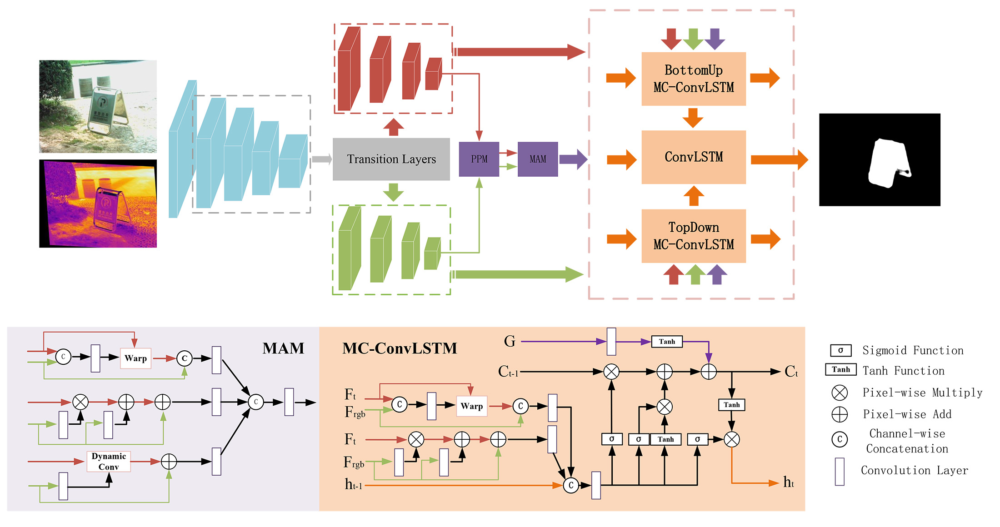
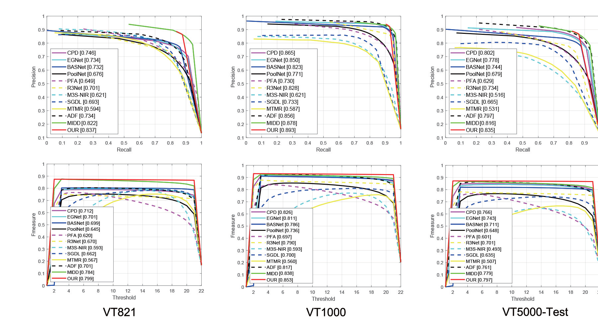

# Deep-Correlation-Network
This is the code of "Weakly Alignment-free RGBT Salient Object Detection with Deep Correlation Network"

### Saved Models
https://pan.baidu.com/s/1Goq5K8qr-uVPvOTcaV1fIQ [egiy]

### Pretrained Model(VGG)
https://pan.baidu.com/s/1EKUMEUrUz9XKu15X4SzHsg [uwm5]

### Unaligned Dataset
https://pan.baidu.com/s/1W8rZFfN5K4-0RK-bXHJRYQ [nrkq] 

### Saliency Maps
https://pan.baidu.com/s/1xtkzcvRfkNtsZ9GUtIIaVQ [9tf7]
